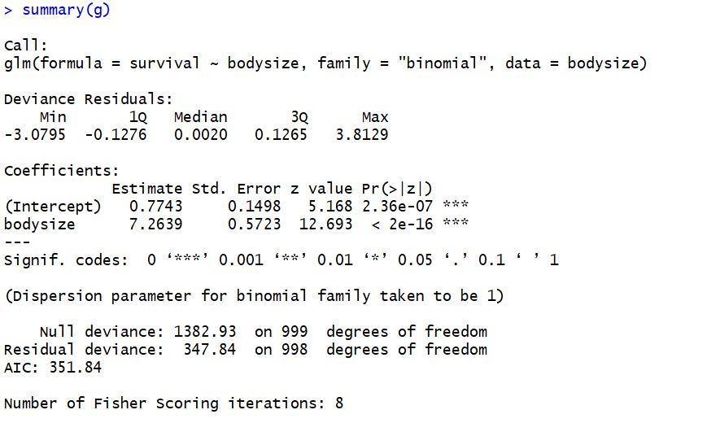

```{r setup, include=FALSE}
library(learnr)
knitr::opts_chunk$set(echo = FALSE)
```


Documentation for creating questions found [here](https://rstudio.github.io/learnr/questions.html)

Cool cool nice these are good questions
http://www.mhhe.com/cgi-bin/netquiz_get.pl?qfooter=/usr/web/home/mhhe/socscience/psychology/dunn/quizzes/test7fq.htm&test=/usr/web/home/mhhe/socscience/psychology/dunn/quizzes/test7q.txt&answers=/usr/web/home/mhhe/socscience/psychology/dunn/quizzes/test7a.txt&email=1


Also good resource: 
http://rstatistics.net/linear-regression-with-r-a-numeric-example/

Good exercise inspo:
https://www.machinelearningplus.com/machine-learning/complete-introduction-linear-regression-r/ 

### Coding in R

## glm output interpretation 

Using the `summary()` function you viewed the details of the logistic regression model. Now how to interpret what you see?

sum_path <- "images/my_summary.JPG"
sum <- readJPEG(sum_path)
dim(sum)


### Call
The first line of the summary is simply showing you the original call to the `glm()` function 

### deviance residuals
The next bit gives you a summary of the deviance residuals. For the purpose of this tutorial we won't go into details about how these are calculated. In the logistic regression the deviance residuals are not as useful. However, you should look out for properties similar to regular residuals. That is ideally they should be centered closely to 0 and roughly symmetrical. 

## R Exercises: Plotting

*Here's a few exercises to get you started coding up a linear regression.*

The first thing to do with any data set is plot it to get a feel for how the 
data is distributed. 

Let's store the speed from the `cars` package (cars$speed) as x and distance as y and plot them. 

```{r corplot, exercise = TRUE}
x=...
y=...
plot(...)
```

```{r corplot-hint-1}
x=cars$speed
y=...
plot(...)
```

```{r corplot-hint-2}
x=cars$speed
y=...
plot(x,y)
```

The graph you produced shows the speed and distance datapoints. 

Now we can use the `scatter.smooth()` function to create a scatter plot with an added smoothed line which will visualise the speed vs. distance correlation.

```{r scatter-plot, exercise=TRUE}
scatter.smooth(...)
```

```{r scatter-plot-hint}
# the main relationship we're going to examine is "Dist ~ Speed"
x=cars$speed
y=cars$dist
scatter.smooth(x, y, main=...)
```

As you can see, the line suggests a positive (and a linear) correlation. This is a good sign if we want to calculate a simple linear regression! 

You can calculate this correlation:
```{r cor, exercise = TRUE}
cor(...)
```

The smooth line fits the data but only shows the positive relationship and does not allow us to make predictions. You will see how it differs from the visualisation of the linear regression later on.
 
Let's create the linear model and store it in a variable `mod`. (The syntax for these models is `predicted variable` ~ `predctor(s)`.)

```{r lm, exercise  = TRUE}
mod <- lm(...)
```

```{r lm-solution}
mod <- lm(y~x)
```

Look at the summary of the model `mod`

```{r summary, exercise = TRUE}
summary(...)
```

Now let's use the original plot and add a linear prediction line based on the model (`mod`) you just created.  

```{r modline, exercise  = TRUE}
plot(..., abline(...))
```

```{r modline-hint}
plot(..., abline(mod))
```

```{r modline-solution}
plot(x, y, abline(mod))

```

Notice the difference between this predictive line and the line fitting the data (using `scatter.smooth`).


## Questions

The Basics
```{r x-pred, echo=FALSE}
question("In a simple linear regression, the X is the... ",
  answer("predictor", correct = TRUE),
  answer("dependent variable")
)
```

```{r y-dv, echo=FALSE}
question("In a simple linear regression, the Y is the... ",
  answer("predictor"),
  answer("dependent variable", correct = TRUE)
)
```

```{r xy-cont, echo=FALSE}
question("To calculate a simple linear regression, both X and Y need to be (typically)... ",
  answer("categorical/factor"),
  answer("numeric/continuous", correct = TRUE)
)

```

