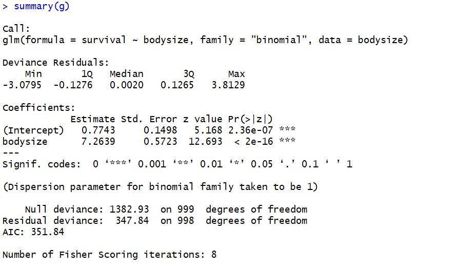

```{r setup, include=FALSE}
library(learnr)
knitr::opts_chunk$set(echo = FALSE)
```

### Coding in R

## Logistic models in R
Because logistic regression can be tricky to wrap your head around, it may seem 
intimidating to try to model it in R. Luckily, R is designed with stats (and you!)
in mind, and has many built-in tools for you to use to create logistic regression models.

Although we used our "Oscars" dataset before, to keep things simple we'll be generating our own data here.

### Generating data
Modeling can be made much more understandable when we generate our own data for 
the task. Through this, we understand how the shape of our data influences the 
outcome of our model (and visualizations). Let's start by generating data here.

Create a function that generates a probability dataframe. Your function could take 
as input the number of observations, and the predictive power of X to predict Y. 
Your dataframe should end with two columns named `x` and `y` where `x` is normally distributed between whatever values you like and `y` is binomially distributed between 0 and 1.

Hint: Remember that to generate `y`, you will need to create a third variable that is
a linear combination of `x` and `correlation`, and then take the inverse logit function
Remember those functions are as follows:
  z = 1 + correlation*x      # linear combination with a bias
  pr = 1/(1+exp(-z))         # pass through an inv-logit function
```{r gen-data, exercise = TRUE} 
generate_data <- function(n, corr) {
  df = ...
  return(df)
}
```

```{r gen-data-hint} 
generate_data <- function(n, corr) {
  # Generate normally distributed X
  x = rnorm(n)           # some continuous variables 
  # Since we're simulating our data we get to decide what we find. 
  # We're going to decide how much these variable increase or decease the odds of our outcome. There will be roughly approxomite to the coefficent estimate we get out of our model (although not exact since we're radomly sampling from a normal distribution).
  correlation=corr
  
  z = 1 + correlation*x      # linear combination with a bias
  pr = 1/(1+exp(-z))         # pass through an inv-logit function
  y = rbinom(n,1,pr)         # bernoulli response variable
  df = data.frame(y=y,x=x)   #pop them all into a data frame
}
```


Now that we have our data, running a linear model is easy. Use the `glm()` function to
create a logistic regression model of `y` from `x`.
```{r glm, exercise = TRUE}
model <- glm(...)
```

```{r glm-hint}
# if you need a hint, type ?glm in the console
model <- glm(..., family="binomial")
```


You can easily view the output of the model using the `summary()` function. Try it below:
```{r view-summary, exercise=TRUE}
summary(...)
```

```{r view-summary-hint}
summary(model)
```


When building the model, try plugging in a `y` (outcome) variable that contains values outside of 0-1. Notice the error that R outputs.
```{r binomial-error, exercise=TRUE}
model <- glm(speed ~ dist, family="binomial", data=cars)
```

## Interpretation of the output

Using the `summary()` function you viewed the details of the logistic regression model. Now how to interpret what you see?

```{r}
library(jpeg)
sum_path <- "images/my_summary.JPG"
knitr::include_graphics(path = sum_path)

fit <-glm(y ~ x1+x2+x3,
 # we include our outcome variabes and all the predictor variables :
 data = df,
 # we specify what data we're using:
 family = "binomial")
 # we specify that we want a logistic rather than linear model:
 
#lets look at our results
summary(fit)


##   would have to change size extra
```


### Call

```{r}
call_path <- "images/my_summary_call.jpg"
knitr::include_graphics(path = call_path)

```

The first line of the summary is simply showing you the original call to the `glm()` function.

### Deviance residuals
```{r}
devres_path <- "images/my_summary_devres.jpg"
knitr::include_graphics(path = devres_path)

```

The next bit gives you a summary of the deviance residuals. In logistic regression the deviance residuals are not as useful and for the purpose of this tutorial we won't go into detail about how to calculate them. However, you should look out for properties similar to regular residuals. That is, ideally they should be centered closely to 0 and roughly symmetrical. 

### Coefficients
```{r}
coef_path <- "images/my_summary_coef.jpg"
knitr::include_graphics(path = coef_path)
```

In this section we can see the coefficient estimates (coefficients - or our "betas" in the model if you'd imagine the equation), including the intercept, the standard errors of the coeffiecients, z-values (which are basically values of the estimates divided by the standard errors), and lastly p-values telling us how statistically significant each of your predictors is (in our case our one predictor is significant). We will relate back to this later.


This refers to the change in log odds per one unit increase of the variable. The effect on probability can be caluculated from log odds. Using the inverse logit function P=exp(logit)/1+exp(logit) we can calculate the probability of our outcome like this.


## Linear Regression: Review

*Here's a few exercises to get you started coding up a linear regression.*

The first thing to do with any data set is plot it to get a feel for how the 
data is distributed. 

Let's store the speed from the `cars` package (cars$speed) as x and distance as y and plot them. 

```{r corplot, exercise = TRUE}
x=...
y=...
plot(...)
```

```{r corplot-hint-1}
x=cars$speed
y=...
plot(...)
```

```{r corplot-hint-2}
x=cars$speed
y=...
plot(x,y)
```

The graph you produced shows the speed and distance datapoints. 

Now we can use the `scatter.smooth()` function to create a scatter plot with an added smoothed line which will visualise the speed vs. distance correlation.

```{r scatter-plot, exercise=TRUE}
scatter.smooth(...)
```

```{r scatter-plot-hint}
# the main relationship we're going to examine is "Dist ~ Speed"
x=cars$speed
y=cars$dist
scatter.smooth(x, y, main=...)
```

As you can see, the line suggests a positive (and a linear) correlation. This is a good sign if we want to calculate a simple linear regression! 

You can calculate this correlation:
```{r cor, exercise = TRUE}
cor(...)
```

The smooth line fits the data but only shows the positive relationship and does not allow us to make predictions. You will see how it differs from the visualisation of the linear regression later on.
 
Let's create the linear model and store it in a variable `mod`. (The syntax for these models is `predicted variable` ~ `predctor(s)`.)

```{r lm, exercise  = TRUE}
mod <- lm(...)
```

```{r lm-solution}
mod <- lm(y~x)
```

Look at the summary of the model `mod`

```{r summary, exercise = TRUE}
summary(...)
```

Now let's use the original plot and add a linear prediction line based on the model (`mod`) you just created.  

```{r modline, exercise  = TRUE}
plot(..., abline(...))
```

```{r modline-hint}
plot(..., abline(mod))
```

```{r modline-solution}
plot(x, y, abline(mod))

```

Notice the difference between this predictive line and the line fitting the data (using `scatter.smooth`).

### Dispersion parameter
```{r}
disp_path <- "images/my_summary_disp.jpg"
knitr::include_graphics(path = disp_path)
```

_You will probably ignore this_ Unlike in linear regression where we estimate both mean and variance, in logistic regression we estimate the mean of the data and the variance is derived from the mean. There is then a chance that the variance could be underestimated. If that's the case, it can be changed from the default in `summary()`.

### Null and residual deviance
```{r}
devi_path <- "images/my_summary_devi.jpg"
knitr::include_graphics(path = devi_path)
```

_You will probably ignore this_ These can be used to compare models, calculate R^2 and the oeverall p-value. 

### AIC score
```{r}
aic_path <- "images/my_summary_aic.jpg"
knitr::include_graphics(path = aic_path)
```

The Akaike Information Criterion is useful for "apple to apple" comparison, meaning comparing models based on the same data (the lower AIC suggests the better model). The number on its own is not very useful. Note: The AIC is basically the residual deviance adjusted for the number of parameteres in the model. 

## Questions

Now head over to the quiz to see how you're doing understanding logistic regression!

